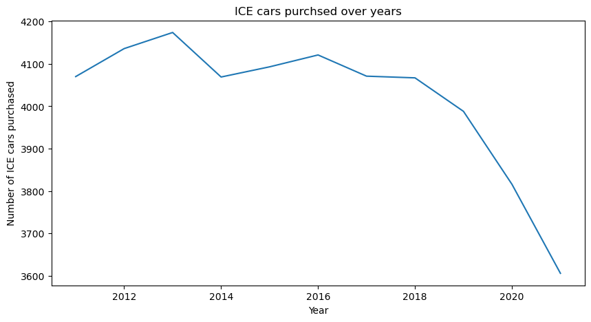

# Germany Vehicle Market

# 

## PROBLEM STATEMENT

### As electric vehicles (EV) are becoming more affortable and assessible to consumers, the consideration for purchase of EV over internal combustion engine (ICE) is increasing.Using the data from one of the Europe lastest car market for the past 10 years (2011 – 2021), analyse the data and provide the following insights:

### 1. Trend of EV and ICE purchase in the past 10 years.
### 2. Consumer preferences of used vs new car when purchasing of EV and ICE.
### 3. Prediction of EV and ICE purchase in the next 5 years.
### 4. Best type of EV and ICE preferred in the past and prediction for the future.

## Q1

### Trend of EV purchase in the past 10 years.
 
From the above graph, the line fluctuates and it shows a decresing pattern. 

### Trend of ICE purchase in the past 10 years.
 
From the above graph, it increases over time. 

### Comparison
 
Real Scale 

 
Normalized Scale

## Q2

### Consumer preferences of used vs new car when purchasing of EV.
 

### Consumer preferences of used vs new car when purchasing of ICE.
 

## Q3
For forecasting method, I use statistical method (ARIMA, Exponential Smoothing), Machine Learning (Linear Rigression, XGBoost), and Recursive multi-step forecasting

### Prediction of ICE purchase in the next 5 years.
First, Autocorrelation and Partial Correlation is computed to identify the relationship among lags.
 
Original Time Series
 
1st Order Time Series
 
2nd Order Time Series 

From the Autocorrelation and Partial Correlation of all condition, the time series is still non-stationary. The time seies must be stationary before applying it to forecasting method because the mean and variance must be constant over time or series. 

#### ARIMA
 

#### Exponential Smoothing
 

#### Machine Learning
 
 
 
 
 

### Recursive multi-step forecasting
 

### XGBOOST
 

### Prediction of EV purchase in the next 5 years.
First, Autocorrelation and Partial Correlation is computed to identofi the relationship among lags.
 
Original Time Series
 
1st Order Time Series

From the Autocorrelation and Partial Correlation of all condition, the time series is still non-stationary. The time seies must be stationary before applying it to forecasting method because the mean and variance must be constant over time or series. 

#### ARIMA
 

#### Exponential Smoothing
 

#### Machine Learning
 
 
 
 
 

### Recursive multi-step forecasting
 

### XGBOOST
 

## Q4

### Best type of EV preferred in the past

### Best type of ICE preferred in the past

### Best type of EV preferred for the future

### Best type of ICE preferred for the future

